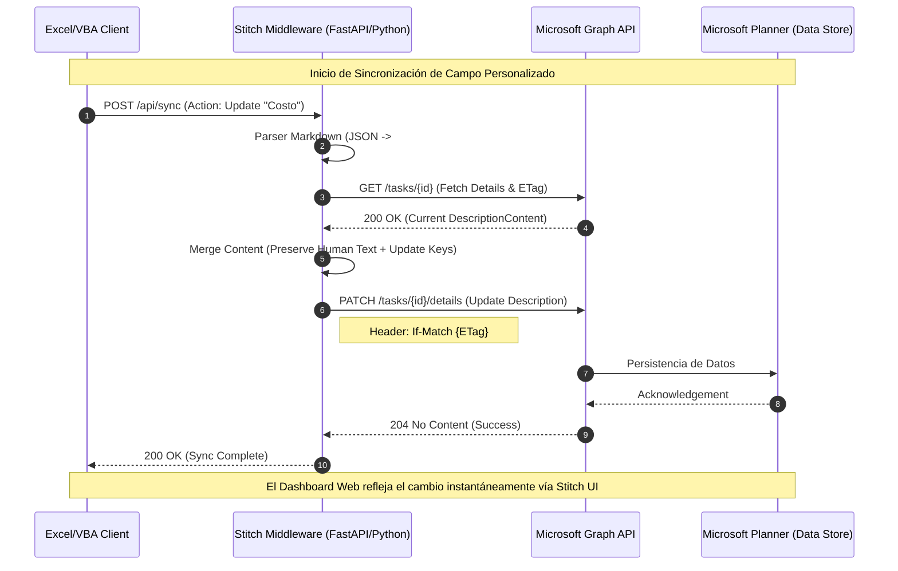

# Pilar 2: Flujo de Datos (Middleware VBA Sync)

Este diagrama detalla el "Hilo Dorado" de la información desde el sistema local (VBA) hasta el núcleo de Microsoft Planner, pasando por nuestro Middleware de "Cose" (Stitch).

## Diagrama de Secuencia: Sync de Columnas Personalizadas

> [!TIP]
> El uso de **ETags** es crítico para evitar colisiones cuando múltiples usuarios (o el script VBA y un humano) editan la misma tarea simultáneamente.

## Estados de Sincronización UI
- **Azul Pulsante**: Sincronización en curso.
- **Verde Sólido**: Datos persistidos y validados.
- **Rojo Alerta**: Conflicto de ETag (requiere intervención manual).
